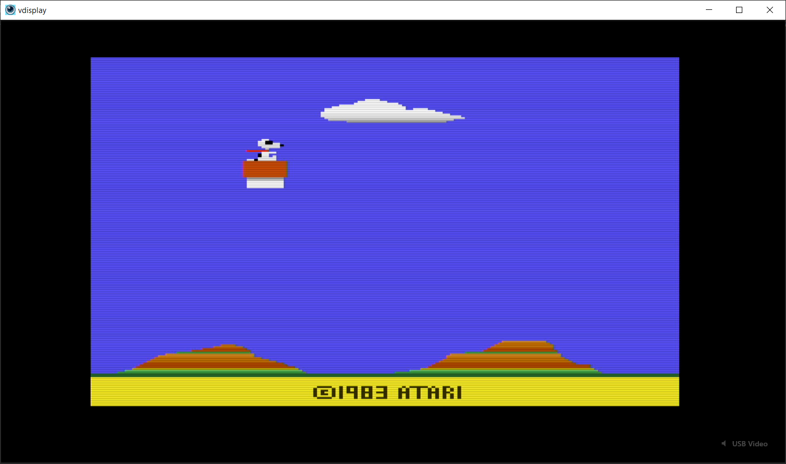

# VDisPlay 📺🔊

🇺🇸 [English](README.md) | 🇧🇷 Português

[](https://github.com/sandrobenigno/VDisPlay/releases/latest)
[](#)
[](#)
[](#)
[](#)
[](LICENSE)

O **VDisPlay** é um monitor de áudio e vídeo em tempo real leve com **latência abaixo de 100ms**, projetado para desenvolvedores, técnicos e gamers.

Desenvolvido para placas de captura HDMI USB e webcams, ele fornece uma maneira rápida e direta de inspecionar a saída de vídeo de consoles de videogame, SBCs, sistemas embarcados, câmeras DSLR e outros dispositivos de streaming — sem a complexidade de suítes de gravação completas como o OBS.

### 📥 [Baixar Última Versão (Instalador & Portátil)](https://github.com/sandrobenigno/VDisPlay/releases/latest)


---

## 🙋 Por que VDisPlay?

A maioria dos softwares de captura é projetada para gravação ou streaming.

O VDisPlay foi desenvolvido para um propósito diferente:

* **Depurar saída de vídeo**
* **Monitorar o comportamento do hardware em tempo real**
* **Testar sistemas embarcados**
* **Inspecionar sequências de inicialização (boot) de consoles**
* **Visualização de HDMI com baixo consumo de recursos**

Seu foco é velocidade, simplicidade e consumo mínimo de recursos do sistema.

---

## ⚡ Principais Recursos

* **Latência ponta a ponta abaixo de 100ms**
* **Interface de visualização em tela cheia minimalista**
* **Monitoramento de áudio em tempo real com seleção de dispositivo de saída** (completamente desacoplado da fonte de vídeo para máxima estabilidade)
* **Silenciamento de áudio (F12) com latência zero**, sem alteração no pitch ou queda de conexão
* **Troca dinâmica de resolução/FPS**
* **Renderização nativa acelerada por GPU**
* **Modo "Sempre no topo" (Always-on-top)**
* **Capturas de tela instantâneas**
* **Correção de reconstrução estéreo para placas de captura de baixo custo MS2109**
* **Ajuste de brilho em tempo real**
* **Modo de inicialização segura para dispositivos de captura instáveis**
* **Interface bilíngue (Inglês / Português)**

---

## 🖱️ Casos de Uso Comuns

O VDisPlay é especialmente útil para:

* Depurar saída HDMI de FPGAs e sistemas embarcados
* Monitorar a inicialização de SBCs (Raspberry Pi, Orange Pi, etc.)
* Inspecionar a saída de consoles retrô
* Visualizar transmissões de câmeras DSLR ou HDMI
* Testar dispositivos de captura
* Monitorar dispositivos externos sem o peso de ferramentas de transmissão

---

## 🛠 Arquitetura

O VDisPlay utiliza uma arquitetura híbrida otimizada para baixa latência.

### 🎨 Frontend (Flutter)

A camada de interface do usuário é construída em Flutter e usa texturas externas nativas para renderizar vídeo diretamente na GPU.

Isso evita cópias de memória caras e reduz a pressão sobre o coletor de lixo (garbage collector) do Dart.

### ⚙️ Backend Nativo (C)

O kernel nativo lida com todas as E/S críticas:

#### 🖥️ Vídeo — Media Foundation

* Captura direta através do `IMFSourceReader`
* Negociação nativa de frames
* Negociação de formato de cor do lado do hardware (BGRA→RGBA, troca otimizada de 32 bits)
* Entrega de frames segura para threads através de seções críticas (*critical sections*)

#### 🔊 Áudio — WASAPI

* Monitoramento orientado a eventos de baixa latência em modo compartilhado com escolha manual do dispositivo de reprodução/saída (fallback automático para o padrão do Windows caso o escolhido seja desconectado)
* Suporte ao modo RAW (ignora o DSP do Windows)
* Medição de VU sem ramificações (*branchless*) via despacho de ponteiro de função
* Reamostragem Cúbica Hermite de alta fidelidade com precisão de ponto flutuante (*float*)
* Compensação dinâmica de drift (Controlador P) que soma a latência local e o *padding* do WASAPI para micro-ajustes precisos no clock do resampler (evita quedas abruptas de pitch)
* Renderizador loopback contínuo executando em segundo plano mesmo quando mutado (envia silêncio) para preservar o sincronismo temporal


#### 🔧 Correção Estéreo MS2109

Alguns dispositivos de captura de baixo custo expõem o áudio estéreo incorretamente como:

`96kHz mono`

O VDisPlay consegue reconstruir:

`48kHz estéreo (L/R)`

em tempo real.

---

## ⌨️ Atalhos de Teclado

| Tecla        | Ação                                      |
| ------------ | ----------------------------------------- |
| `M`          | Menu de dispositivos                      |
| `H`          | Ajuda / Sobre                             |
| `R`          | Menu de resolução / FPS                   |
| `F` / `F11`  | Alternar tela cheia                       |
| `ESC`        | Fechar menus / sair da tela cheia         |
| `T`          | Alternar "Sempre no topo"                 |
| `S`          | Capturar tela (screenshot)                |
| `+`          | Aumentar brilho                           |
| `-`          | Diminuir brilho                           |
| `F12`        | Alternar monitoramento de áudio           |
| `1–9`        | Troca rápida de dispositivo de vídeo      |

---

## 🚀 Compilação

### 📋 Requisitos

* Windows 10/11 (x64)
* SDK do Flutter (com desktop habilitado)
* Visual Studio 2022
* CMake

### Compilação Rápida

```powershell
.\build.bat
```

Executável final:

```text
build\windows\x64\runner\Release\vdisplay.exe
```

### Desenvolvimento

```powershell
flutter run
```

---

## Estrutura do Projeto

```text
lib/                    → Interface, overlays, bindings FFI, internacionalização (i18n)
native/
  include/common.h      → Utilitários compartilhados, GUIDs, auxiliares de dispositivo
  video_capture.c       → Kernel de captura do Media Foundation
  audio_capture.c       → Kernel de captura + loopback do WASAPI
  device_manager.c      → Enumeração de dispositivos + inicialização COM
windows/runner/         → Ponte de textura nativa
build.bat
CMakeLists.txt
```

---

## Filosofia

O VDisPlay segue um princípio simples:

**Uma ferramenta de monitoramento não deve ficar no caminho.**

Sem linhas do tempo.
Sem cenas.
Sem pipeline de gravação.
Sem abstrações de transmissão.

Aenas o seu sinal — rápido, direto e visível.
